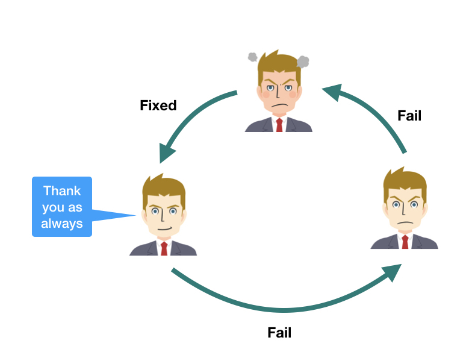
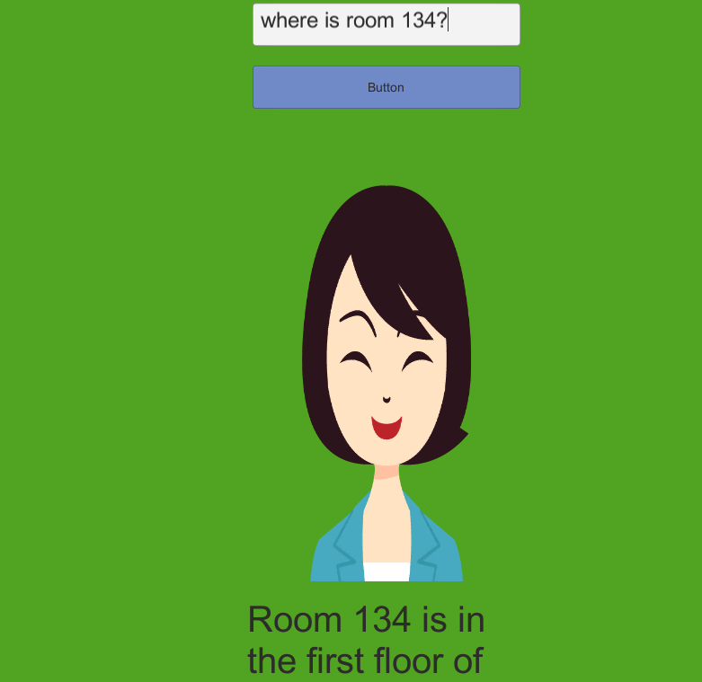

# DialogueFirm

DialogFirm is a simple chat bot engine for the Unity platform. Given input sentences, DialogFirm detects
the intent and then returns the the sentence for reply. DialogueFirm provides an Amazon Alexa styled JSON configuration.
In addition, functions for practical applications such as state transitions or slot type matching are provided.

The following image shows the an image of the state transitions. In the image, we can see the state of guide changed
by input sentence from users.



## Features

* Simple configuration with JSON (AWS Alexa style)
* Support state transistions



## Basic Usage

DialogFirm has `BotEngine` which manages the dialogue with the user following
specified configuration file. We can create a `BotEngine` specifying a configuration file.
The following is a sample of creating a `BotEngine` object.

```
void CreateBot()
{
    string settingFilePath = Application.dataPath + "/DialogFirm/Scenes/simple-bot-conf.json";
    string setting = File.ReadAllText(settingFilePath);
    this.bot = new BotEngine(setting);
}
```

This example reads configuration stored in file `Application.dataPath + "/DialogFirm/Scenes/simple-bot-conf.json"` and then load the settings to a string `setting`.
Then it creates the BotEngine object.

NOTE: configuration files of BotEngine are stored as `Streaming Assets`. Details of `Streaming Assets`, please see the document.


After we create a `BotEngine` instance, the instance is ready to get input sentence.
Adding input sentence (string type),  `BotEngine` returns the reply sentence following the given setting file.

```
public void RespondToInput(string input)
{
    var reply = this.bot.ReplySentence(input);
    text.text = reply;
    inputField.text = "";
}
```

In the following sections, we learn the configurations and practical usage of the DialogFirm framework.

## License 

GNU GENERAL PUBLIC LICENSE Version 3
